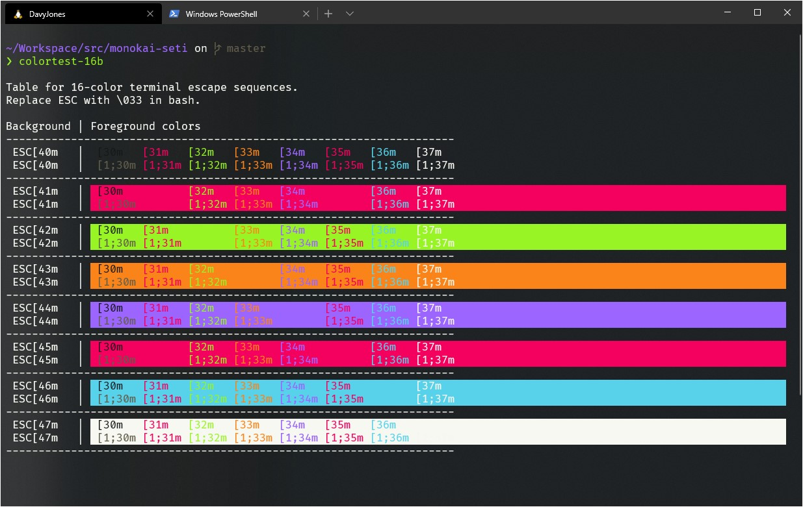

# Monokai Set Theme

## Windows Terminal


### Install
Open Windows Terminal settings and add the content of `windows/terminal/monokai-seti.json` to the `schemes` list.

```
[...]
"schemes": [
    <<ADD HERE>>
  ],
[...]
```

## Todo
- [x] Add VSCode
- [x] Add Konsole
- [ ] Add KDE
